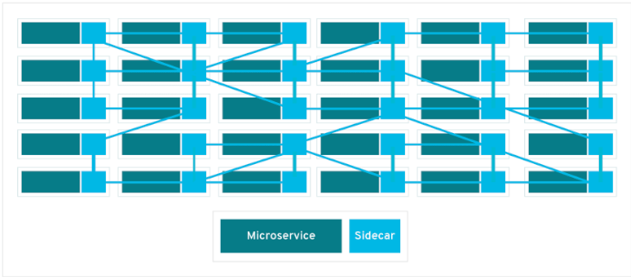
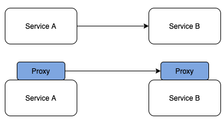
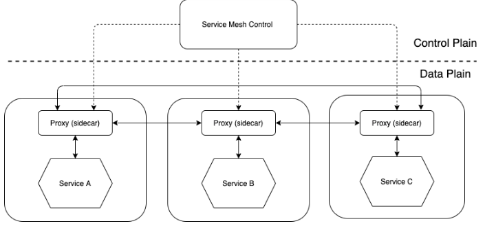

# Service Mesh

## Reference

### Service Mesh

- https://www.baeldung.com/ops/istio-service-mesh
- https://daddyprogrammer.org/post/13700/service-mesh/
- https://yumdata.tistory.com/m/350
- https://www.redhat.com/ko/topics/microservices/what-is-jaeger
- https://blog.naver.com/PostView.nhn?blogId=pst8627&logNo=221670903384

### Service Discovery

- https://bcho.tistory.com/1252
- https://mangchhe.github.io/springcloud/2021/04/07/ServiceDiscoveryConcept/

### Load Balancing

- https://blog.envoyproxy.io/examining-load-balancing-algorithms-with-envoy-1be643ea121c
- https://www.envoyproxy.io/docs/envoy/latest/intro/what_is_envoy

## 란?

> 서비스 간 통신을 제어/관리에 특화된 마이크로 서비스 인프라 계층

기존의 아키텍처에서 호출이 서비스를 직접 호출하는 방식이었다면, `Service Mesh`에서의 호출은 자체 인프라 계층의 `proxy`를 통해
이뤄지게 됩니다.

## Mesh Network;

`service mesh`에서는 요청이 자체 인프라 계층의 `proxy`를 통해 마이크로서비스 간에 라우팅이 되며, 개별 `proxy`는 서비스
내부가 아닌 각 서비스와 함께 실행 되어 `sidecar`라고도 표현됩니다.
이러한 `sidecar proxy`들이 모여 `mesh network`를 구성하게 됩니다.

## MSA의 단점;

만약 마이크로 서비스가 `service mesh`가 없이 동작한다면 각 서비스간 커뮤니케이션을 통제하는 로직으로 코딩을 해야하기 때문에
개발자들이 비즈니스 로직에 집중하기 어렵고, 커뮤니케이션 장애를 진단하기 어려워집니다.

이렇게 거대해진 시스템은 수십개의 마이크로 서비스로 분리되고 운영환경에는 수천개의 서비스 인스턴스가 동작하게 되면 서비스간 통신도 매우 복잡해
지면서 새로운 장애 지점이 계속 발생하게 됩니다.

이런 복잡한 마이크로 서비스 아키텍처 내에서 서비스 메시 없이는 장애 발생 지점을 찾기가 거의 불가능합니다.

## Service Mesh의 이점;

서비스간 커뮤니케이션의 모든 부분을 성능 Metric으로 캡처하게 되며 `service mesh`를 활용하면 아래와 같은 내용이 실현
가능합니다.

- 개발자들이 서비스간의 안정적인 연동에 집중하는 대신 비즈니스의 가치를 추가하는 일에 집중 가능
- `Jaeger`를 통한 요청의 분산 추적은 서비스와 함께 가시적인 인프라 계층을 제공하므로 문제를 손쉽게 인식하고 진단
- 장애가 발생한 서비스로부터 요청을 다시 라우팅할 수 있기때문에 다운타임 발생 시 애플리케이션 복구 능력이 향상
- 성능 Metric을 통해 런타임 환경에서 커뮤니케이션을 최적화하는 방법을 제안

> #### Jagger
> 분산 서비스 간 트랜잭션을 추적하는 오픈소스 소프트웨어로 마이크로 서비스 환경을 모니터링하고 문제를 해결하는데 사용

## 주요 기능;

- 요청 라우팅 제어
- 계단식 장애 방지(서킷 브레이크)
- 부하 분산 알고리즘(로드밸런싱)
- 보안 기능(TLS, 암호화, 인증 및 권한)
- 서비스간 계층에서 계측 정보를 제공하는 Metric

## 구조;

`service mesh`에서의 서비스 호출은 `proxy`끼리 이뤄지게 되며 이는 `서비스의 트래픽을 네트워크단에서 통제`할 수 있게 하고,
클라이언트의 요구에 따라 `proxy`단에서 `라우팅 서비스`도 가능하게 할 수 있습니다.

이러한 다양한 기능을 수행하려면 기존 TCP 기반의 proxy로는 한계가 있으며, service mesh 에서의 통신은 sidecar로 배치된
경량화 되어있는 L7 계층 기반의 proxy를 사용하게 됩니다.

> #### L7
> - OSI 7계층중 application layer를 뜻하며, 사용자와 가장 밀접한 계층으로 인터페이스의 역할을 합니다.
> - 응용 프로세스 간의 정보 교환을 담당하며 대표적으로 email, 인터넷, 동영상 플레이어 등이 있습니다.

## Control Plain 과 Data Plain;

service mesh는 `control plain`과 `data plain`으로 구성되어 있습니다.

### Control Plain;

트래픽을 제어하는 정책 및 구성에 따라 proxy에게 설정값을 전달하고 관리하는 컨트롤러 역할을 합니다.

### Data Plain;

proxy를 통해 마이크로 서비스 간에 오고 가는 모든 네트워크 통신을 조정하고 제어합니다. 
`Service Discovery`, `Load Balancing`, `TLS Termination`, `Circuit Breaker` 등의
기능을 제공하며 가장 인기있는 data plain은 `Envoy proxy`가 많이 사용됩니다.

### Envoy Proxy;

C++로 개발된 고성능 proxy이며, 아래와 같은 기능을 수행합니다.

- 자세한 설명은 아래 URL 참고

  https://www.envoyproxy.io/docs/envoy/latest/intro/what_is_envoy

| 기능 |
|--------------------------------------------|
| Dynamic Service Discovery |
| Load Balancing |
| TLS Termination |
| HTTP/2 and gRPC Proxies |
| Circuit Breakers |
| Health Checks |
| Staged rollouts with % based traffic split |
| Fault Injection |
| Rich Metricsx |

## API Gateway vs Service Mesh;

두 서비스는 모두 서비스의 검색, 요청 라우팅, 인증, 속도 제한, 모니터리을 모두 처리하지만 적용 되는 위치와 아키텍처 형태 등의 차이가
있습니다.

| 분류      | API Gateway                                                 | Service Mesh                                                |
|---------|-------------------------------------------------------------|-------------------------------------------------------------|
| 적용 위치   | 네트워크 외부의 트래픽을 수락하고 내부에 배포  (Client-Side Discovery Pattern) | 네트워크 내부에서 트래픽을 라우팅하고 관리 (Server-Side Discovery Pattern) |
| 아키텍처 형태 | 집중형 아키텍처로 SPOF(Signle Point Failure) 생성                     | 분산형 아키텍처로 SPOF를 생성하지 않고 확장에 용이                              |
| 패턴      | Gateway proxy pattern을 사용해서 수행                              | Sidecar Proxy Pattern을 사용해서 수행                              |

Service Mesh 기술은 빠르게 발전하며 API Gateway의 일부 기능을 수행하기 시작했으며, 클라우드 네이티브 공간이 발전하고 더 많은 조직이 Docker, k8s를 사용하여 MSA를 관리함에 따라 병합 될 가능성이 높습니다.(아빠 프로그래머 피셜)
